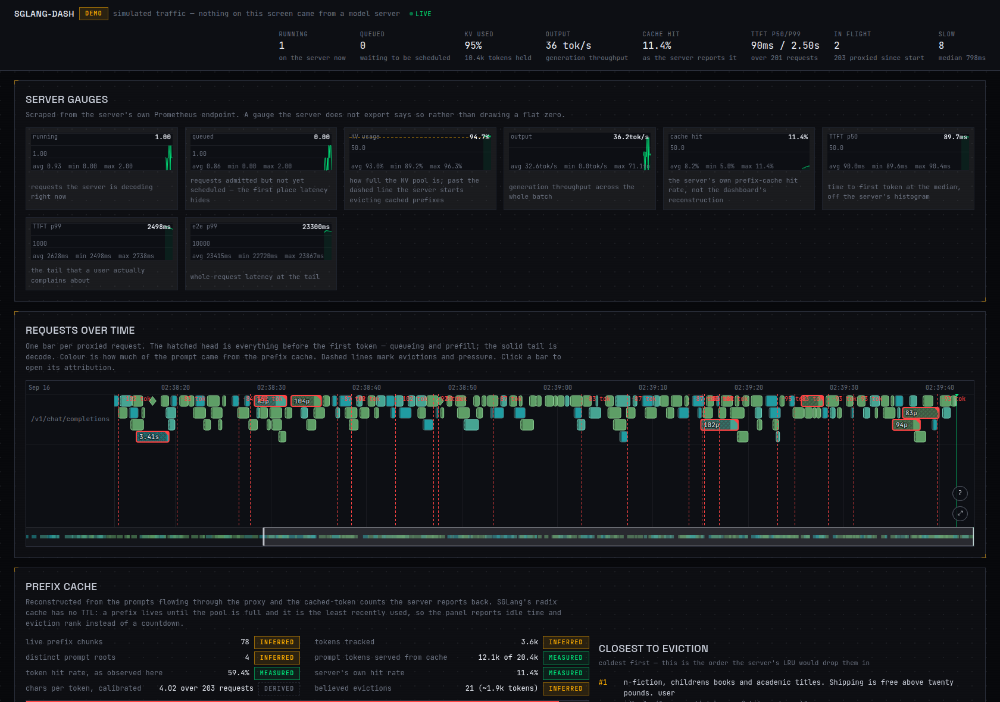

# sglang-dash

An observability dashboard for an [SGLang](https://github.com/sgl-project/sglang) server. One Go binary, UI embedded. Copy it and run it.



That is the real page, captured from `sglang-dash -demo` by a headless browser. Reproduce it with `sglang-dash -demo` and open `http://localhost:8080`.

## Run it

```sh
sglang-dash -upstream http://127.0.0.1:30000
```

Point your client at the dashboard instead of the server, at `http://localhost:8080/v1`. It proxies every request through and records what it sees. To look around without a GPU, run `sglang-dash -demo` for the built-in traffic simulator. Every screen it draws is labelled DEMO.

## What it shows

- **Server gauges.** Running and queued requests, KV pool usage, generation throughput, the server's own cache hit rate, and the TTFT and end-to-end quantiles.
- **Requests over time.** One bar per request. The bar splits into the wait before the first token and the decode after it. Its colour is how much of the prompt came from the prefix cache.
- **Prefix cache.** Which prompts are cached, and how full the pool is. How long each prefix has been idle, and which one is next to be dropped. What was lost when something was, with the evidence behind each reason.
- **Requests.** A filterable table whose rows open onto a latency waterfall. It splits queue wait, prefill of uncached tokens, decode, decode contention, and whatever is left unattributed.
- **Activity.** Every event the collectors published.

## Why it proxies

SGLang publishes aggregate metrics and no per-request feed. The prompt, the cached-token count the server reports for it, and its first-token time only exist together on the wire. So the dashboard sits on the wire.

## Honesty about the cache view

The prefix tree is reconstructed from observed traffic. It is not read out of the server. Token counts come from the server and are marked `measured`. The tree shape, the per-chunk token split and every eviction reason are marked `inferred`, in the API and on screen.

SGLang's radix cache has no TTL. Nothing expires on a clock. The server drops the least recently used prefix when it needs room. So the panel reports idle time and eviction rank rather than a countdown.

## Flags

Every flag has an `SGLANG_DASH_`-prefixed environment twin. Run `sglang-dash -h` for the full list. These are the ones you are most likely to want.

| Flag | What it does |
| --- | --- |
| `-upstream` | the SGLang server to proxy and observe |
| `-demo` | run the simulator instead |
| `-listen` | address to serve on (default `:8080`) |
| `-redact-prompts` | keep hashes and lengths, never prompt text |
| `-slow-floor-ms` | wall time under which a request is never called slow |

## Build

```sh
npm --prefix web ci && npm --prefix web run build   # writes web/dist
go-toolchain                                        # tests, vets and builds
```

`web/dist` is committed because `go:embed` needs it at compile time. CI rebuilds it and fails on any difference. A stale asset cannot ship.

## Theme

The page wears [Scratch Proto](https://github.com/wow-look-at-my/scratch_ui), the org's design language: exposed wireframe, dot-grid substrate, monospace type, amber caution accents. Tokens and components are fetched from the library site at runtime, so an upstream change to the language reaches this dashboard with no work here.

`app.css` carries no colour of its own. It aliases Scratch tokens onto the names the chart components read, so overriding a token on `:root` re-themes every panel at once.

## Documentation

- [docs/architecture.md](docs/architecture.md) — the collectors and how they fit
- [docs/cache-model.md](docs/cache-model.md) — how the prefix tree is inferred
- [docs/slow-attribution.md](docs/slow-attribution.md) — how latency is split
- [docs/metrics.md](docs/metrics.md) — the upstream metrics it looks for
